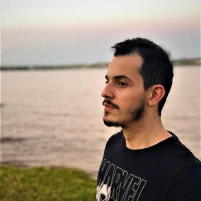

# Querido Diário

<p align="center">
  
</p>

Este repositório é destinado a documentação do processo de evolução de software do projeto de código aberto [Querido Diário](https://queridodiario.ok.org.br/).  
A seguir temos a lista de repositórios utilizados pelo time de desenvolvimento para a evolução deste software:

* [Front-End](https://github.com/Wildemberg-Projects/querido-diario-frontend)
* [Back-End](https://github.com/Wildemberg-Projects/querido-diario-backend)
* [API](https://github.com/Wildemberg-Projects/querido-diario-api)
* [Data Processing](https://github.com/Wildemberg-Projects/querido-diario-data-processing)
* [Raspadores](https://github.com/okfn-brasil/querido-diario)

## Contribuidores

| Foto | Nome | Github | Email |
| :--: | :--: | :----: | :---: |
|  | Arthur Ferreira | [ArthurFerreiraRodrigues](https://github.com/ArthurFerreiraRodrigues) | arthur.250402@gmail.com |
|   | Cristian Furtado | [csafurtado](https://github.com/csafurtado) | cristiansafurtado@gmail.com |
|  | Ester Lino | [esteerlino](https://github.com/esteerlino) | esteerlino@gmail.com |
|  | Pedro Cabeceira | [pkbceira03](https://github.com/pkbceira03) | cabeceira2003@gmail.com |
| | Raissa Oliveira | [raissamsoliveira](https://github.com/raissamsoliveira) | raissa.menezesousa@gmail.com |
|  | Wildemberg Sales | [wildemberg-sales](https://github.com/wildemberg-sales) | wildemberg.sales.junior@gmail.com |

## Como Executar

### 1. Instale o pacote que usamos para documentação ([docsify](https://docsify.js.org/))
```
npm i docsify-cli -g
```

### 2. Execute a documentação
```
docsify serve ./docs
```

### 3. Acesse a aplicação no seu navegador

## Encerrando a Execução

Para encerrar a execução da aplicação, você pode pressionar Ctrl + C no terminal onde está sendo executado.
